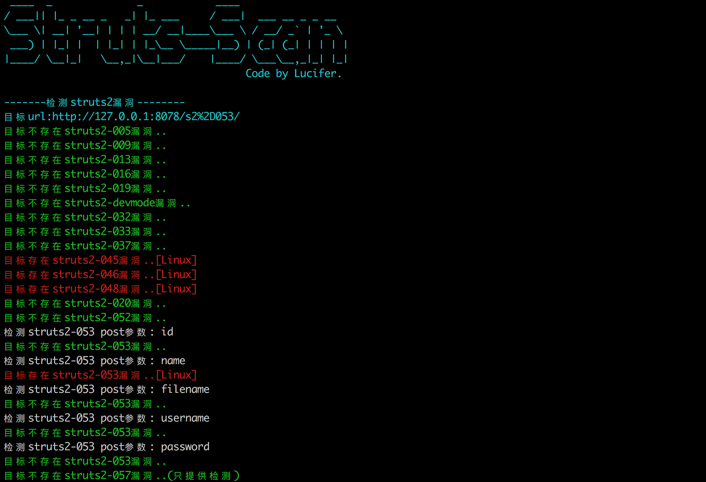
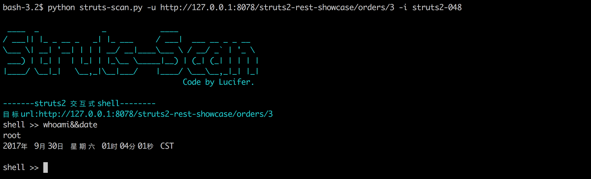

# struts-scan
快速检测struts命令执行漏洞，可批量。

# 运行环境
MAC/Linux下的Python2

# 支持对以下版本的检测

ST2-005

ST2-009

ST2-013

ST2-016

ST2-019

ST2-020

ST2-devmode

ST2-032

ST2-033

ST2-037

ST2-045

ST2-046

ST2-048

ST2-052

ST2-053

# 使用

# 增加
[+]针对各版本的shell命令交互

[+]struts2-052检测(利用后面会加上)

[+]struts2-053检测+利用(需要提供参数)

[+]检测过程中输出超时原因

[+]兼容HTTP/1.0，修复了struts-045检测不准确的问题

[+]struts2-046检测+利用

[+]修改struts2-048的payload

[+]针对某些超时的情况,注释掉 httplib.HTTPConnection._http_vsn = 10 和httplib.HTTPConnection._http_vsn_str = 'HTTP/1.0'这两行再测试一遍,因为有的可能不支持HTTP/1.0的协议。

[+]增加linux和win的可执行文件,windows需要.NET环境。

[+]增加写入文件功能,针对有漏洞的struts版本号会自动写入success.txt文件。
# 特别说明
此工具仅限于漏洞验证，如若使用者引起相关的法律责任请自负，开发者不承担连带责任。
